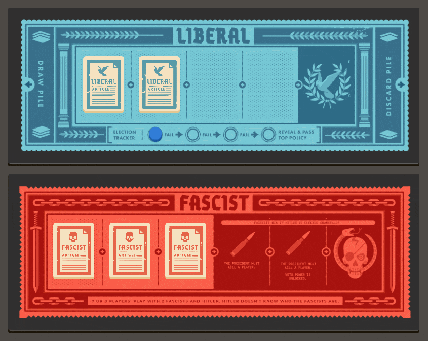
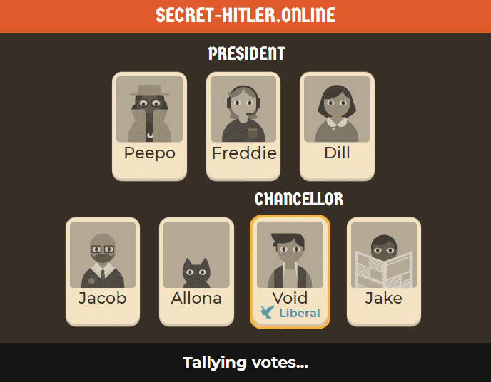

# Secret-Hitler-Online

A browser-based adaptation of Secret Hitler for up to 20 players online.

### The Game
In the game, players are divided into Liberals, Fascists, and one secret Hitler. The Liberals must work together (or not) to discover the secret Hitler hiding in their midst, all while the Fascists try to elevate the secret Hitler to power. Pass policies to achieve victory and unlock presidential powers to investigate your friends. 

Can you find and stop the Secret Hitler?

### How to Play: 
Start your deployment, open a new lobby, and share the generated invite link with your friends. You can play with up to 20 players at once.

There are instructions on how to play the game provided on the website, and plenty of helpful tips are provided for first-time players. The game takes care of rules for you, making it easy to pick up and play. 

For more information, read the [official rulebook here](https://www.secrethitler.com/assets/Secret_Hitler_Rules.pdf).

## About this project
### Technical Details
The Java server is divided into the [game simulation](src/main/java/game) and the [REST API](src/main/java/server). Communication between the server and client is done via websocket and HTTP requests, using the [Javalin library](https://javalin.io/).

The frontend is written in [React](https://reactjs.org/), and features animations created with CSS. Assets were either adapted from the original board game or created using [Inkscape](https://inkscape.org/).

### Creative Commons License and Credit
Secret Hitler Online is licensed under [Creative Commons BY-NC-SA 4.0](https://creativecommons.org/licenses/by-nc-sa/4.0/), and is based on the original Secret Hitler board game.

#### What's changed from the original?

- Artwork for the boards, policy deck, identity cards, party cards, and liberal/fascist icons were adapted for the website with some minor modifications (rounding corners, adding depth, shadows).
- Custom assets (made in Inkscape) were added based on the style of the original, most notably for the election tracker, policy reveal popup windows, and the player icons and tiles.
- Where possible, fonts were replaced with ones licensed under the [Open Font License](https://scripts.sil.org/cms/scripts/page.php?site_id=nrsi&id=OFL), namely [Germania One](https://fonts.google.com/specimen/Germania+One) and [Montserrat](https://fonts.google.com/specimen/Montserrat).
- The web interface, animations, and server are new additions that use the same rules from the original game.

### Report problems or suggest features on the [Issues page](https://github.com/NightMachinery/Secret-Hitler-Online/issues).
