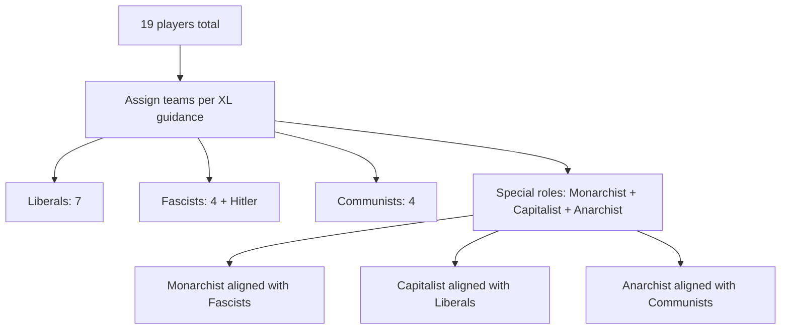

# Secret Hitler Large-Group Rule Extensions for 10+ Players

## Executive summary

Secret Hitler is officially designed for 5–10 players and released under a Creative Commons BY–NC–SA 4.0 license, which is why a sizeable ecosystem of fan-made print-and-play variants and expansions exists. citeturn17search7turn9search11 This report focuses on the most widely surfaced “rule extensions” that explicitly enable play beyond 10 players or are commonly presented as “10+” adaptations, prioritizing primary/community hubs (official Secret Hitler pages, BoardGameGeek, Reddit, Steam Workshop).

Across public community artifacts, **Secret Hitler XL** (by Bo‑Jivan Parker / u/Lord_Roguy) stands out as the most complete and most repeatedly referenced large-group framework: it targets “more than 10 players,” scales to **19 players** in its author’s public discussion, adds a **third faction (Communists)**, and provides multiple modular mechanisms to extend game length and add investigative/assassination opportunities that become necessary as player count grows. citeturn10view0turn6search6turn19search4

A smaller, earlier large-group approach is the BoardGameGeek community design **“Communists and up to 12 players”** (credited to BGG user Ziga / @Vinetou in later derivative works), which adds Communists plus an “Independence track” and supports **up to 12 players**, but is much less standardized in publicly accessible documentation compared with Secret Hitler XL. citeturn36search0turn36search2

A separate (and numerically popular on Steam Workshop) item titled **“Secret Hitler Expansion”** (by LuneNoir & Tuna O.) is tagged for **10+** and shows high Steam engagement, but its main rulebook is hosted on Google Drive, which may be inaccessible depending on viewer permissions; as a result, several mechanics can only be partially confirmed from its Steam description/comments/change notes. citeturn33view0turn38search7

## Research methods and ranking approach

This research used public web sources with preference for: official Secret Hitler materials (rules/license), primary rule documents (PDFs), and major community hubs where variants are announced or maintained (Reddit r/SecretHitler, BoardGameGeek, Steam Workshop). citeturn17search7turn10view0turn33view0turn36search0

Popularity ranking in this report is *evidence-weighted* rather than purely numeric because exact counts are not consistently accessible across hubs. The ranking combines:

- Cross-platform presence (appears independently on multiple hubs: Reddit + downloadable rules + derivative physical builds, etc.).
- Direct “large-player” intent (explicit support for >10 players, not merely “works at 10”).
- Available engagement metrics (Steam unique visitors/subscribers/favorites; visible comment activity; visible derivative ecosystem like MakerWorld/Thingiverse builds).
- Recency and sustained activity (e.g., comments years after release).

Where exact counts are unavailable, the report states that explicitly and uses relative indicators instead.

## Popularity ranking and comparison tables

### Ranked list by popularity

**Most popular → least popular (within this report’s scope and evidentiary limits):**

1. **Secret Hitler XL (Bo‑Jivan Parker / u/Lord_Roguy)**  
   Justification: explicitly built for “more than 10 players,” sustained discussion on r/SecretHitler, widely referenced across community ecosystems (rule PDF mirrors, Steam Workshop module, MakerWorld/Thingiverse physical builds, mentions in online-implementation feature requests), and includes concrete scaling guidance up to 19 players. citeturn10view0turn6search6turn13search10turn19search4turn9search13

2. **Secret Hitler Expansion (Steam Workshop; LuneNoir & Tuna O.)**  
   Justification: extremely strong Steam engagement metrics (unique visitors/subscribers/favorites) and an active comment thread; however, full rule verification depends on the linked external rule PDF access. citeturn33view0turn38search7

3. **Communists and up to 12 players (BoardGameGeek thread; Ziga / @Vinetou)**  
   Justification: older (longstanding) large-player concept and referenced as a foundational component by later derivative expansions, but fewer visible, consistently accessible metrics in the sources we could reliably parse. citeturn36search0turn36search2

4. **Secret Hitler anarcho/communist expansion + alternative Hitler roles (Steam Workshop)**  
   Justification: has clear public rules in the Steam description and modest but measurable engagement; appears more niche and less cross-linked than the items above. citeturn36search1turn36search2

### Comparison table of key attributes

| Extension | Primary goal | Supported player count (as stated) | New factions/teams | Notable new mechanics | Evidence of popularity (selected) |
|---|---|---:|---|---|---|
| Secret Hitler XL | Extend to **>10** while staying “somewhat balanced” | “Up to 20” stated in rules doc, but creator clarifies **up to 19** | Adds **Communists**; optional extra roles across teams | Communist policy track + powers; anti-policies; emergency powers to extend length and add investigations/executions | Reddit announcement + ongoing replies; widely mirrored rule PDF; MakerWorld/Thingiverse derivative builds; appears in BGG “known versions” list citeturn10view0turn6search6turn19search4turn6search9turn9search13 |
| Secret Hitler Expansion (Steam) | “Enrich gameplay” w/ new roles/missions + balance tuning | Listed as 6–10+ | Unclear (rules PDF on Drive) | “Anarchy Cards” referenced; additional roles/missions | Steam: **11,072** unique visitors; **3,887** current subscribers; **167** favorites; **35** comments citeturn33view0turn38search7 |
| Communists and up to 12 players (BGG) | Add Communists + enable larger group | Up to **12** | Adds **Communists** | “Independence track” win conditions; Communists know each other | Referenced by later expansions as source for communist tracker/role design citeturn36search0turn36search2 |
| Anarcho/communist expansion (Steam) | Add Communists + anarchist/policy chaos | Not explicitly bounded; example at 10 | Adds Communists; adds Anarchist victory condition via policy chaos | Recruitment; “5-year plan” shuffle; anarchist policy cascade; retroactive policies to lengthen game | Steam: **403** unique visitors; **86** subscribers; **2** favorites citeturn36search1turn36search2 |

### Simple popularity chart from available numeric metrics

Only some projects expose consistent numeric engagement without login barriers. The bars below use **Steam “Unique Visitors”** where available (not a cross-platform total).

```text
Steam Unique Visitors (higher ≈ more exposure on Steam)
Secret Hitler Expansion (LuneNoir)   | ############################### 11072
Socialist expansion (Exon9)          | ##                              661
Anarcho/communist expansion          | #                               403
```

Steam metrics for “Secret Hitler XL” itself were not captured in the sources we could parse in this run; its popularity ranking is therefore based on multi-hub presence and derivative ecosystem rather than a single platform counter. citeturn33view0turn16view0turn36search1turn10view0turn19search4

### Role distribution flow example for large tables (Secret Hitler XL at 19 players)



This distribution matches publicly listed XL ratios for 19 players. citeturn10view0turn19search4

## Rule extension dossiers

```markdown
# Secret Hitler XL

Name
- Secret Hitler XL

Author / source
- Rules designer/organizer: Bo‑Jivan Parker (u/Lord_Roguy) (credited in the XL rules document and Reddit announcement)
- Communists are explicitly described as edited/adapted from a prior “Secret Hitler Socialist Expansion” (credited to u/mrkvicka & u/havosh in XL materials)

Concise description
- A modular large-group expansion intended to push Secret Hitler beyond 10 players by (a) adding a third party (Communists), (b) adding optional new roles that can tune balance and add alternative incentives, and (c) adding “game length / investigation / assassination” tools (anti-policies and emergency-power policies) so the table can still reach meaningful information before the game ends.

Player count supported
- 11–19 players are explicitly supported in public materials; “up to 20” appears in some versions of the XL rules doc, but the creator clarifies it should be “up to 19.”
- Also includes guidance for 6–10 with Communists (for groups that want the faction without a huge table).

Setup changes
- Add a Communist policy tracker/board (with different track layouts/power orderings depending on player count).
- Add Communist party membership cards and Communist policy tiles to the overall component set.
- Modify the “eyes closed” setup sequence to include a Communist reveal phase (Communists learn each other early in the game).
- For 10+ games, incorporate additional “game length” tools (anti-policies and/or emergency power policies) so more players can cycle through government.

Role changes (new roles or altered role counts)
- Adds a new PARTY: Communists (with their own membership cards, policies, track, and “Communist presidential powers”).
- Adds optional roles (examples cited in XL materials and downstream builds):
  - Anarchist (communist-aligned; included as a balance/chaos lever; variant win conditions exist across editions)
  - Capitalist (liberal-aligned)
  - Monarchist (fascist-aligned; designed to adjust incentives around Hitler becoming Chancellor or being executed)
  - Nationalist (listed in the XL rules doc’s table of contents / role list)
- Provides explicit party ratios for large tables (examples: 11–16, and special handling for 17–19 with “mix & match” special roles).

Rule changes
Voting
- Base election mechanics are generally preserved, but the expansion adds new policy outcomes and additional executive-type effects (especially via emergency powers).

Policy deck
- Communist policies are introduced.
- Optional “anti-policies” exist that remove progress from opposing tracks (used to extend game length and rebalance).
- Optional “Emergency Power” policies (e.g., Article 48 / Enabling Act) can be added to expand the set of executive actions available and to create additional information/pressure in large groups.

Special powers (examples discussed in XL materials)
- Communist board powers vary by player count and include named powers such as:
  - Bugging
  - Radicalisation
  - 5-year plan
  - Congress
  - Confession
- Emergency power policies introduce additional one-off actions (examples listed in the XL rules doc): propaganda-style peeks, multi-card peeks, impeachment-style forced reveals to a chosen player, “marked for execution” delayed kills, direct executions, pardons, and “vote of no confidence” style overrides.

Timing / pacing changes
- Explicitly recommends extending game length for >10 so more players become President/Chancellor at least once and to avoid “game ends before half the table plays government.”
- Emergency powers and anti-policies are positioned as tools to increase “action density” and information flow.

Balance considerations
- XL rules explicitly warn it is not play-tested enough and relies on modular customization.
- Includes multiple balance dials:
  - swap roles within a faction (e.g., replacing a standard fascist with a Monarchist-type role to alter incentive structure)
  - add/remove anti-policies to change race dynamics across tracks
  - add emergency power cards at higher player counts (with caps) to increase investigation/assassination opportunities
  - change board/track lengths (e.g., different liberal track lengths) depending on whether Liberals feel advantaged/disadvantaged

Common variants / optional rules
- “Communists-only” shorter/alternate tracker suggestion exists (using fewer communist powers) in XL rules doc.
- Mix-and-match special roles (Monarchist/Capitalist/Anarchist) at very high player counts.
- Optional anti-policies and emergency powers are explicitly modular: groups can include none, some, or many.

Popularity metrics (with primary links)
- Reddit: the announcement thread shows multi-year discussion and continued Q&A activity; it also provides alternate download mirrors (e.g., Mega) when Drive links break.
- Steam Workshop: there is a “Secret Hitler XL” Workshop item linking to the Reddit thread and Drive folder; comment activity is visible.
- MakerWorld / Thingiverse: multiple creators publish physical/3D-printable components explicitly “based off” Secret Hitler XL.
- BoardGameGeek: the “English Print & Play edition” page lists “Secret Hitler XL” among notable known versions.
- GitHub: community issue requests exist asking for Secret Hitler XL support in online implementations.

Primary sources (URLs)
- XL rules PDF (mirror): https://obj.vassalengine.org/images/0/01/Secret_Hitler_XL_Rules.pdf
- Reddit announcement / discussion (u/Lord_Roguy): https://www.reddit.com/r/SecretHitler/comments/qhj8fr/ive_made_secret_hitler_xl_expansion_with_a_bunch/
- BoardGameGeek “known versions” listing that includes Secret Hitler XL: https://boardgamegeek.com/boardgameversion/301129/english-print-and-play-edition
- MakerWorld (example XL physical build page with ratios and board layout notes): https://makerworld.com/en/models/1052392-secret-hitler-xl-communist-expansion
- Thingiverse (example XL-derived printable board): https://www.thingiverse.com/thing:5906956
- Steam Workshop (XL item): https://steamcommunity.com/sharedfiles/filedetails/?id=2652375964

Implementation notes & playtesting tips
- Facilitation: for 11+ players, script your “night” phases (including any communist reveal steps) and keep them short; consider appointing a neutral facilitator for the first few games.
- Table management: enforce speaking turns or a “talking token” in early rounds to prevent high-player chaos from burying actionable claims.
- Track length sanity check: ensure your combined policy-track capacity is large enough that most players can plausibly be in government at least once; XL rules emphasize game-length extension as non-optional at very high counts.
- Component hygiene: XL variants introduce many new card backs/types—use opaque sleeves or consistent print stock to prevent identifying cards.
```

Key evidence for the Secret Hitler XL dossier: XL is explicitly designed to support >10 players and describes modular tools like anti-policies and emergency power policies to extend game length and increase investigation/assassination opportunities. citeturn6search6turn32search4turn10view0 Public postings and downstream component projects explicitly cite support up to **19 players** and provide example role ratios and board layouts for “10+”. citeturn10view0turn19search4 The BGG “known versions” list includes Secret Hitler XL as a notable variant, indicating community prominence. citeturn6search9

```markdown
# Secret Hitler Expansion (Steam Workshop mod)

Name
- Secret Hitler Expansion

Author / source
- Steam Workshop creators listed: LuneNoir and Tuna O. (Steam Workshop page)
- Rules hosted externally as “Secret Hitler Expansion Rules.pdf” on Google Drive (linked from the Steam Workshop page)

Concise description
- A digitally-distributed (Tabletop Simulator) expansion/mod that claims to add “new roles and missions” and “mechanical adjustments... to improve team balance,” while keeping the original game’s dynamics, and is tagged for 10+ players.

Player count supported
- Steam metadata lists Number of Players: 6, 7, 8, 9, 10+.

Setup changes
- Not fully verifiable from the Steam text alone because the detailed rule PDF is hosted on Google Drive (access may depend on permissions).
- Based on Steam change notes, “Anarchy Cards” are “randomly drawn” and can influence play, implying an additional deck/module added to setup.

Role changes (new roles or altered role counts)
- Steam description states “new roles and missions,” but role list and counts are in the external rules PDF (not directly visible in the Steam page text excerpts we could reliably parse).
- Steam comments indicate an “anarchist” win condition interacts with placing an “anarchy card” onto the liberal board.

Rule changes (voting, policy deck, special powers, timing)
- Not fully verifiable without the external rules PDF.
- However, Steam change notes explicitly describe “Anarchy Cards... randomly drawn” that can “trigger unexpected events or provide advantages,” suggesting a new randomized event layer beyond the base game’s policy deck.

Balance considerations
- The Steam page claims “mechanical adjustments... to improve team balance,” but specifics require the external rule PDF.
- The presence of randomized “Anarchy Cards” suggests higher variance; groups may need to tune inclusion rate if games swing too hard.

Common variants / optional rules
- Unknown from Steam excerpts; likely described in the external PDF and/or in “Change Notes.”

Popularity metrics (with primary links)
- Steam Workshop page shows:
  - 11,072 Unique Visitors
  - 3,887 Current Subscribers
  - 167 Current Favorites
  - 35 Comments
- The mod is actively maintained (Posted Dec 7, 2023; Updated Apr 4, 2025 shown on Steam).

Primary sources (URLs)
- Steam Workshop (main listing): https://steamcommunity.com/sharedfiles/filedetails/?id=3107841031
- Steam Workshop change notes (mentions “Anarchy Cards” addition): https://steamcommunity.com/sharedfiles/filedetails/changelog/3107841031
- (Linked, but access-dependent) Rules PDF (Google Drive): https://drive.google.com/file/d/1Wtjbvd1ZapXu6SO-OaKLNIlZIrndQFMP/view?usp=sharing

Implementation notes & playtesting tips
- Verify rules access early: have the host download/cache the Google Drive rules PDF before game night in case players can’t access it.
- Because event-style “Anarchy Cards” add variance, playtest with and without them for your group’s tolerance; record win rates over ~10 games before locking defaults.
- For 10+ online tables, enforce a speaking protocol (timer or turns) to keep rounds from stalling.
```

Key evidence for the Steam “Secret Hitler Expansion” dossier: Steam’s listing explicitly reports 10+ player support in metadata and provides strong engagement metrics (unique visitors/subscribers/favorites) plus maintenance dates and comment volume. citeturn33view0 Its change notes explicitly describe “Anarchy Cards” as randomly drawn, influencing the game and adding strategic depth. citeturn38search7

```markdown
# Communists and up to 12 players (Independence track variant)

Name
- Communists and up to 12 players

Author / source
- Posted on BoardGameGeek; later derivative works attribute the “communist independence tracker” to BGG user Ziga (@Vinetou).

Concise description
- A community expansion/variant that adds Communists and an “Independence track,” with alternate Communist victory conditions, and explicitly scales the game up to 12 players.

Player count supported
- Up to 12 players (as stated in the BoardGameGeek thread title and description).

Setup changes
- At the start of the game, Communists know who they are (team-reveal step added to the standard setup).
- Adds an Independence track that accumulates “articles,” including communist articles.

Role changes (new roles or altered role counts)
- Adds Communists as a distinct team/faction (at least two Communists are implied in the win condition text).
- Uses the terms “president” and “councillor” (the latter appears to function like Chancellor in base rules).

Rule changes (voting, policy deck, special powers, timing)
- Introduces new Communist win conditions tied to:
  - Hitler being assassinated by a Communist President, contingent on the Independence track containing at least one Communist article.
  - A situation where the Independence track has 3+ articles including at least one Communist article AND both Communists are elected as Councillor and President.
- Other deck/power changes are not fully visible in the accessible excerpt; details likely include additional policy/article cards that interact with the Independence track.

Balance considerations
- By conditioning the “Communists execute Hitler” win on the Independence track containing at least one Communist article, the design appears to prevent an immediate alternate win path unless the Communist agenda has visibly advanced.
- Because it adds an additional faction objective, social signaling and coalition dynamics become more complex; expect longer discussion time at 11–12 players.

Common variants / optional rules
- Not fully recoverable from the excerpt; later expansions cite this as a component-level source (tracker/role concepts), suggesting many groups remix rather than adopt as a strict standard.

Popularity metrics (with primary links)
- Numeric engagement metrics (views/replies/downloads) are not reliably visible in this run.
- Relative indicators:
  - It is repeatedly cited as a source for communist tracker ideas in later Steam Workshop expansions, indicating memetic influence.

Primary sources (URLs)
- BoardGameGeek thread: https://boardgamegeek.com/thread/1584173/communists-and-up-to-12-players
- (Derivative reference example) Steam Workshop item citing this BGG thread: https://steamcommunity.com/sharedfiles/filedetails/?id=2397327841

Implementation notes & playtesting tips
- If you introduce a third faction at 11–12 players, explicitly teach the table how Communist victory interacts with standard Liberal victory (especially around “executing Hitler”).
- Track clarity matters: print the Independence track large enough for the whole table to see; ambiguity about which articles are on the track will cause disputes.
- Consider a “first-game training” where you temporarily disable the most complex win condition (e.g., the dual-office Communist win) until players learn the base flow.
```

Key evidence for the “Communists and up to 12 players” dossier: the BoardGameGeek thread excerpt explicitly states up-to-12 support, Communists knowing each other at the start, and specific Independence-track-based win conditions. citeturn36search0 A later Steam Workshop expansion explicitly credits “BGG user Ziga @Vinetou” and points users back to this BGG thread for the communist tracker/independence concept. citeturn36search2

```markdown
# Secret Hitler anarcho/communist expansion + alternative Hitler roles

Name
- Secret Hitler anarcho/communist expansion + alternative Hitler roles

Author / source
- Steam Workshop Tabletop Simulator item (creator name not reliably captured in the excerpt, but the module contains detailed rules in its Steam description).
- Credits within the Steam description reference: u/havosh (socialist tracker assets), u/therazblitz (dictator role cards), and BGG user Ziga @Vinetou (communist secret role card design).

Concise description
- A modular “Communists + Anarchist-policy chaos” ruleset distributed as a Tabletop Simulator item. It adds a communist tracker + recruitment mechanic, plus anarchist/syndicalist/strasserist/retroactive policy ideas to change game pace and introduce alternate win triggers.

Player count supported
- Not explicitly bounded in the Steam text excerpt; it provides an explicit 10-player example and describes ratios as “1/3rd of liberals should be replaced with communists,” implying the approach scales with player count if components are available.
- Practically, many groups will interpret this as targeting the standard 10-player cap while changing faction composition; physically scaling beyond 10 would require printing additional envelopes/cards/tracks.

Setup changes
- Replace roughly 1/3 of Liberals with Communists (example given for 10 players).
- Introduces Communists as a faction with:
  - A communist tracker/board
  - Communist membership cards
  - Communist policy cards
- Introduces a “Recruitment” procedure (blindfold phase) where Communists secretly convert a player by handing them a Communist party membership card.

Role changes (new roles or altered role counts)
- Adds Communists as a separate faction with distinct win conditions.
- Mentions “alternative Hitler roles” and “dictator role cards” exist in the module, but the excerpt does not enumerate them.

Rule changes (voting, policy deck, special powers, timing)
- Communist win conditions:
  - Communists share Liberal goals, but if Communists assassinate Hitler they win.
  - Communists also win if their tracker is filled.
- Recruitment:
  - During a blindfold phase, Communists secretly recruit a player into Communists by giving them a Communist membership card.
- 5-year plan:
  - Shuffle 2 communist policies and 1 liberal policy into the policy deck.
- Anarchist policy behavior:
  - When enacted, discard it, shuffle another anarchist policy into draw pile, and enact a random policy from top of draw pile.
  - If an anarchist policy is enacted randomly from the top (e.g., chaos policy enact or chain), the anarchist wins.
- Retroactive policies (optional):
  - Remove a policy from whichever tracker is proportionally leading; used to lengthen games.

Balance considerations
- Recruitment can be swingy: it increases Communist voting power over time and may cause hidden snowball effects if recruitment is frequent or too early.
- Anarchist win-by-random-draw creates high-variance endings; it can be fun but may frustrate groups seeking “deduction over roulette.”
- Retroactive policies are explicitly framed as an optional lever to make games longer (useful when many players create “not enough turns for everyone” pressure).

Common variants / optional rules
- “Syndicalist and strassarist policies are experimental” (module explicitly advises groups to “do what you like”).
- Retroactive policies are optional.
- Implicit variant: tune communist fraction lower/higher than 1/3 depending on table experience.

Popularity metrics (with primary links)
- Steam Workshop page shows:
  - 403 Unique Visitors
  - 86 Current Subscribers
  - 2 Current Favorites
  - Posted Feb 15, 2021 (updated same day in Steam metadata excerpt)

Primary sources (URLs)
- Steam Workshop listing: https://steamcommunity.com/sharedfiles/filedetails/?id=2397327841
- BGG thread referenced for communist independence tracker: https://boardgamegeek.com/thread/1584173/communists-and-up-to-12-players

Implementation notes & playtesting tips
- If you plan to run this above 10 players in person, print extra envelopes/vote cards and confirm component opacity; scaling problems are usually physical, not logical.
- Run a calibration set (5–8 games) tracking:
  - how often recruitment happens before 3 fascist policies
  - how often anarchist random-win triggers
  - win rate split across factions
- Consider “training wheels”:
  - disable anarchist random-win for first session
  - delay recruitment until after a threshold (e.g., after the first communist policy) if early snowball occurs
```

Key evidence for the anarcho/communist expansion dossier: the Steam Workshop description contains explicit mechanical text (replacement ratios, communist win conditions, recruitment procedure, 5-year plan shuffle, anarchist policy cascade, retroactive policy concept) and visible engagement metrics (unique visitors/subscribers/favorites). citeturn36search1 It also explicitly cites BGG user Ziga/@Vinetou and links back to the BGG “Communists and up to 12 players” thread as a reference point. citeturn36search2

## Synthesis for 10+ player Secret Hitler sessions

### Why 10+ is structurally hard

The official game’s victory conditions and power ramp are calibrated for 5–10 players. citeturn9search11turn17search7 When you go past 10, two predictable failures emerge (and large-group expansions tend to address exactly these):

First, **turn scarcity**: with a clockwise presidency and term limits, more players means fewer expected “meaningful government turns” per player before the game ends. Secret Hitler XL explicitly calls out the need to extend game length so everyone can plausibly become President/Chancellor at least once. citeturn6search6

Second, **information dilution and social noise**: more players increases the number of possible coalition narratives and reduces the signal of any single voting record. Expansions respond by adding more direct information tools (investigations, forced reveals, extra execution hooks) and/or by adding new factions with their own information structures (e.g., Communists who know each other). citeturn6search6turn36search0

### Practical facilitation tips that consistently help

Using a written “session script” for setup (including any extra faction reveal phases) reduces early errors, especially when multiple hidden-team reveals occur in sequence. This is implicitly supported by the frequency with which XL discussion threads include Q&A about setup logistics and updated links/materials. citeturn10view0

For 11–19 player in-person games, mechanics that increase action density (additional executive actions, anti-policies that pull tracks back, delayed executions) generally reduce the “we argued for 40 minutes and learned nothing” problem, which is exactly how XL motivates emergency powers and anti-policies for large tables. citeturn6search6turn19search4

For online (Tabletop Simulator) 10+ play, “event” modules like the Steam Expansion’s Anarchy Cards can keep games lively but will increase variance; consider treating them as optional until you have baseline win-rate data for your group. citeturn38search7turn33view0

## Source notes and limitations

Some BoardGameGeek thread pages and some Google Drive-hosted rule PDFs are not consistently accessible in a text-parsable way without user login or permission. In those cases, this report relies on (a) publicly indexed excerpts, (b) Steam Workshop descriptions/comments/change notes, and (c) cross-references from derivative projects that explicitly cite their upstream sources. citeturn36search0turn33view0turn36search2

Secret Hitler XL is the best-documented “10+” framework in sources that are directly readable as a standalone rules PDF mirror and a detailed Reddit announcement thread; that combination is a major reason it can be analyzed more rigorously than several Steam-first variants whose full rules live behind access-dependent file hosts. citeturn6search6turn10view0turn33view0